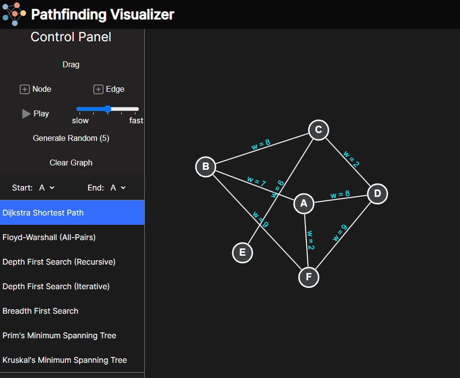

# pathfinding-visualizer

## Interactive visualization tool for pathfinding and graph traversal.

This project enables users to create custom graphs and apply various algorithms for pathfinding and graph traversal. 
Algorithms:
1. Dijkstra Shortest Path
2. Floyd-Warshall (All-Pairs)
3. Depth First Search (Recursive)
4. Depth First Search (Iterative)
5. Breadth First Search
6. Prim's Minimum Spanning Tree
7. Kruskal's Minimum Spanning Tree

## Usage
- Go to https://gigiotoya.github.io/pathfinding-visualizer/
- Pick algorithm of choice
- Change Edge weights by reselecting algorithm choice
- Choose Start and end points
- Use the +Edge option, then click and drag between two nodes to create a new edge
- Use the +node option to create a new node
- Press Play to visualize

